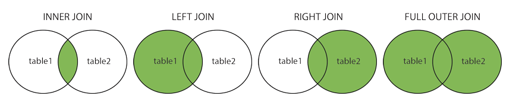

# JOIN

Here are the different types of the JOINs in SQL:

* `(INNER) JOIN`: Returns records that have matching values in both tables
* `LEFT (OUTER) JOIN`: Returns all records from the left table, and the matched records from the right table
* `RIGHT (OUTER) JOIN`: Returns all records from the right table, and the matched records from the left table
* `FULL (OUTER) JOIN`: Returns all records when there is a match in either left or right table

## INNER JOIN

Documentation in [SQL INNER JOIN Keyword](https://www.w3schools.com/sql/sql_join_inner.asp).

## LEFT JOIN

Documentation in [SQL LEFT JOIN Keyword](https://www.w3schools.com/sql/sql_join_left.asp).

## Exercises

1. Select all users' roles. Hint: each user could have multiple roles.
2. Select only users with role 'admin'.
3. Select only users that have at least 1 `sales_orders`.
4. Select number of users' orders.
5. Select number of users' ordered products.
6. Select only product names with tags ('rubbish', 'cool') and category 'food'. 